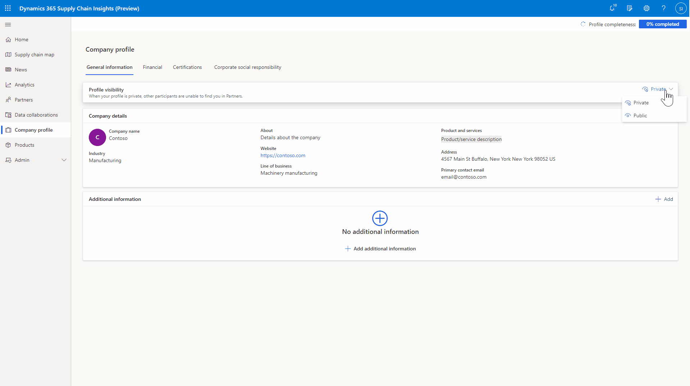

# Company profile

[!include[banner](includes/banner.md)]
[!include[banner](includes/preview-banner.md)]

In your company profile in Microsoft Dynamics 365 Supply Chain Insights, you can add general information and corporate details, financial information, certifications, and corporate social responsibility actions.

## Complete your company profile

Your company profile initially contains only the name of your company and the profile picture. This data is based on the information in your Azure Active Directory (Azure AD) tenant. To update your company profile, select **Company profile** in the left navigation, and then select **Edit** or **Add** in the upper-right corner of the profile section that you want to update. You can complete each part of the company profile section separately if you don't have all the information available or you want to finish your profile later.

## Public and private company profiles

To make your profile discoverable to your partners' users, set the **Profile visibility** field on the **Basic information** tab to **Public**. If your profile is public, users can find it on the **Partners \> Find Partners** tab, and they can connect with you to collaborate and derive data insights. If your profile is public, all of the information in the **Company details** section on the **Basic Information** tab of your company profile is shown to all participants in Supply Chain Insights.

If the **Profile visibility** field is set to **Private**, unconnected partners can't discover your profile and can't connect with you on the **Partners \> Find Partners** tab. If your company profile is private, users can only initiate a connection with you if they manually send a connection request by email. Once you connect with a partner, the **Company details** section of your company profile will be visible to that partner. 

## Additional resources

[Set up Supply Chain Insights](set-up.md)

[Import your data](ingest-data.md)

[Create your supply chain network](partners.md)
