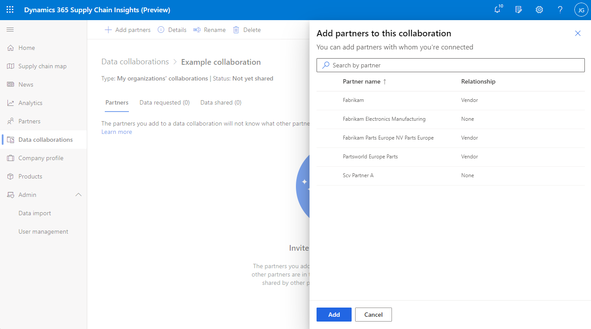
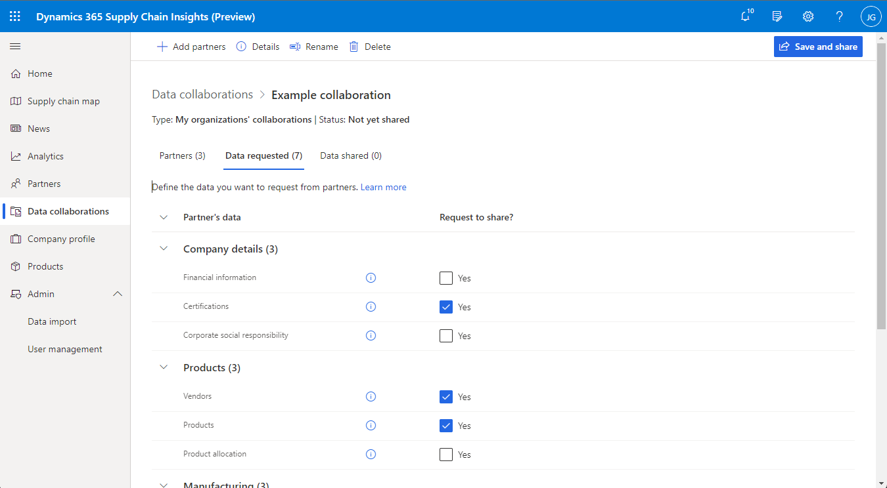
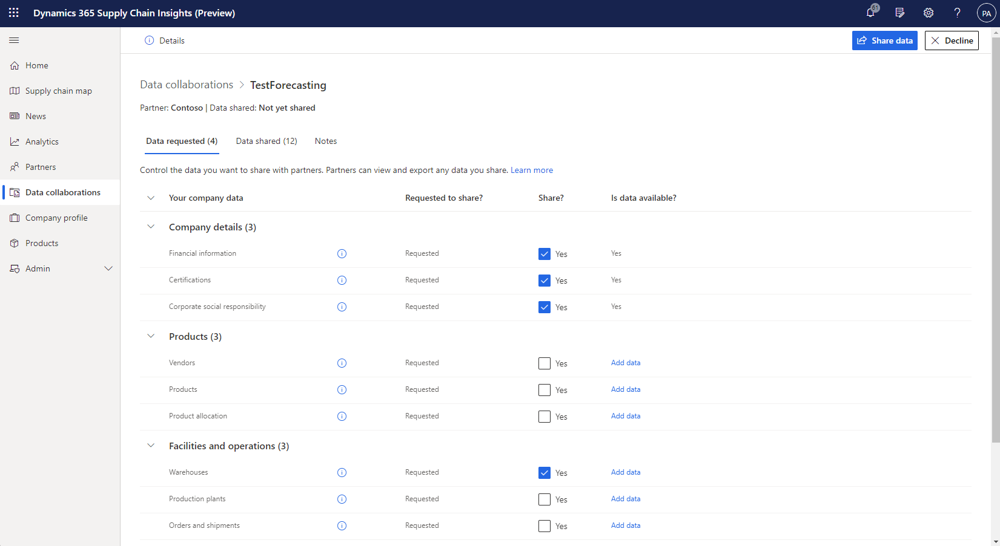
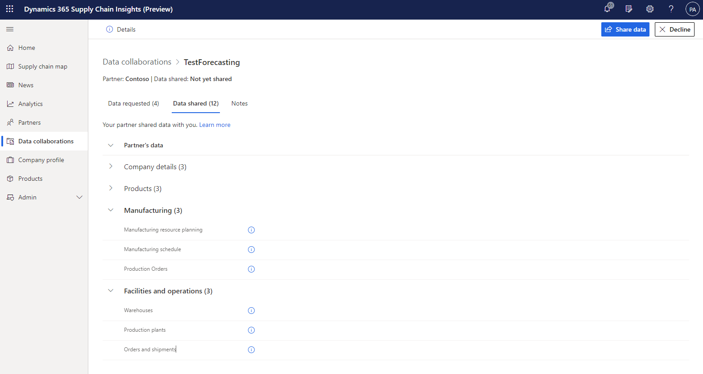
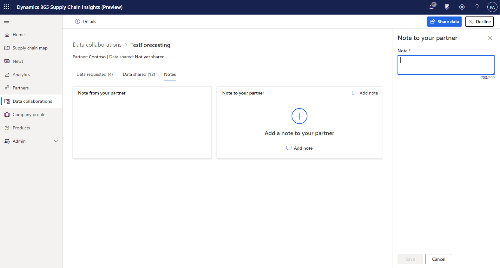

# Create data collaborations

[!include[banner](includes/banner.md)]
[!include[banner](includes/preview-banner.md)]

This topic describes how to create data collaborations in Microsoft Dynamics 365 Supply Chain Insights.

The health of your supply chain depends on your suppliers and customers. Therefore, data sharing between you and your partners is vital, so that everyone has more visibility into their supply chain. Dynamics 365 Supply Chain Insights makes data sharing a straightforward process by creating data collaborations. Because these collaborations take your partners' information into account, they can generate more insights about your supply chain.

## Prerequisites

Before you start a data collaboration, you should be aware of what happens and what can happen when you share your data with partners in Supply Chain Insights. You should also determine which data-related responsibilities are assigned to your company and which are assigned to Microsoft, to ensure that you meet your company's expectations. If you and a partner that you share data with keep Supply Chain Insights data in different locations, your data might be copied to a different region. Additionally, although partners might view and use the data that you share with them in Supply Chain Insights, they might also export it and use it outside Supply Chain Insights. To review your and Microsoft's responsibilities about data sharing, see the [Supply Chain Insights terms of service agreement](https://go.microsoft.com/fwlink/?linkid=2175113).

Collaborations require connected partners who use Supply Chain Insights. They also require ingested data that is shared with those partners.

## Create a data collaboration 

### Send a request
 
To start a new data collaboration, select **Data collaborations** in the left navigation pane, and then select **New collaboration** on the command bar. After you start a new data collaboration, you must enter a name for it, add a partner or partners, and specify which data should be shared. You must then save and share the collaboration.

### Add partners
 
You can add one or more partners, depending on whether you created the collaboration on the **Data collaborations** page or through the partner section. You can add partners who are also in other collaborations, because a partner can join multiple collaborations at the same time. After partners are added, you can select the chat symbol next to a partner's name to open a sidebar. There, you can enter an optional note to send to the partner. Different partners can receive different notes, or all partners can receive the same note. Not all partners have to receive a note. Partners will see the notes as part of the invitation for the new data collaboration.

### Request data from partners

The **Data requested** tab determines what information your partners will share with you. It contains a list of the data entities that can be requested. To request an entity, select the appropriate checkbox in the **Request to share?** column. You can request all entities, some entities, or no entities.

### Share data with partners

The **Data shared** tab resembles the **Data requested** tab. However, it determines what information you will share with your partners. Your partners can then use the data in any way that Supply Chain Insights allows, including exporting data out of Supply Chain Insights. You, not Microsoft, are responsible for ensuring that a partner complies with any agreements you have with them regarding how the partner uses your data, including data protection agreements.

## Respond to a request

You can respond to a data collaboration request through the email invitation, the notification on the home page, or the **Partners' collaborations** tab of the **Data collaborations** page. Data collaborations that haven't been responded to on the **Partners' collaborations** tab will have a 0-percent visibility score. Additionally, when they are selected, they will show a **Decline** button in the upper right, above the information about what data is being shared.

### View the requested data and share your data

The **Data requested** tab of a partner's collaboration page contains a list of the data entities that were requested and the data entities that you're sharing. To accept a data collaboration request, you don't have to share all the requested entities. You can also share data that wasn't requested.

Regardless of what entities you share, the partners you share the data with can use that data in any way that Supply Chain Insights allows it, which includes the ability to export data out of Supply Chain Insights. You, not Microsoft, are responsible for ensuring that a partner complies with any agreements between you (including any data protection agreements) in how that partner uses your data.

### View the data that is shared with you

The **Data shared** tab of a partner's collaboration page resembles the **Data requested** tab. However, it contains information about what data your partner is sharing with you in the data collaboration. If the partner is involved in other data collaborations with you, it might already be sharing some of the data on this tab with you. You, not Microsoft, are responsible for ensuring that when you use data a partner shares with you, that you are complying with any agreements between you and that partner (including any data protection agreements).

### View and add notes

The **Notes** tab contains notes that you and your partner have sent to provide additional information, such as the purpose of the data collaboration and the reason why some data has or hasn't been shared.

### Send a response

After you've finished reviewing a data collaboration request, you can send a response by selecting either **Share data** or **Decline** in the upper-right corner. If you accept the data collaboration, the **Visibility score** column on the **Partners' collaborations** tab shows the percentage of the requested data that you shared. If you decline a collaboration, it's removed from the **Partners' collaborations** tab.
