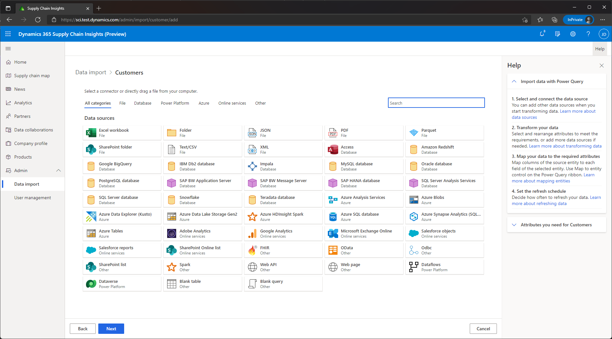
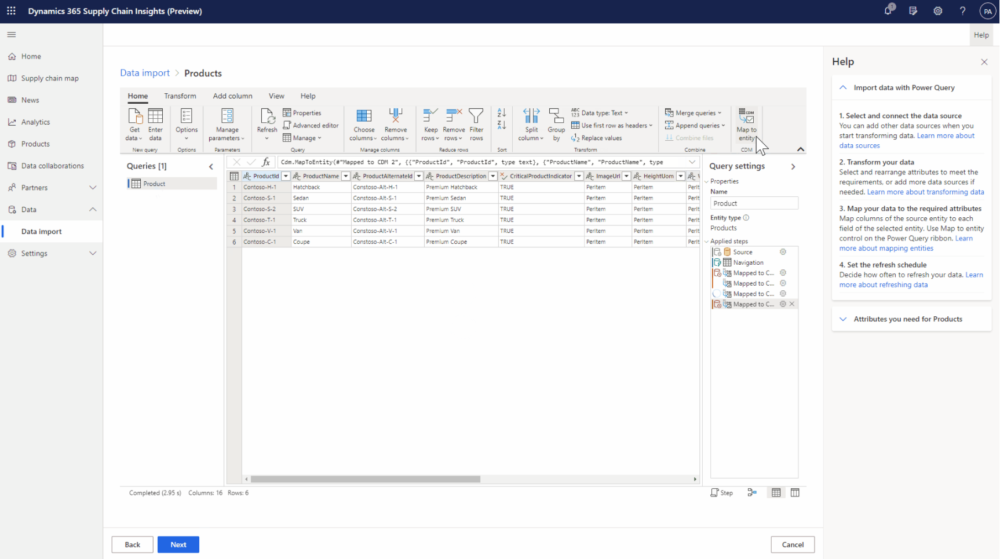
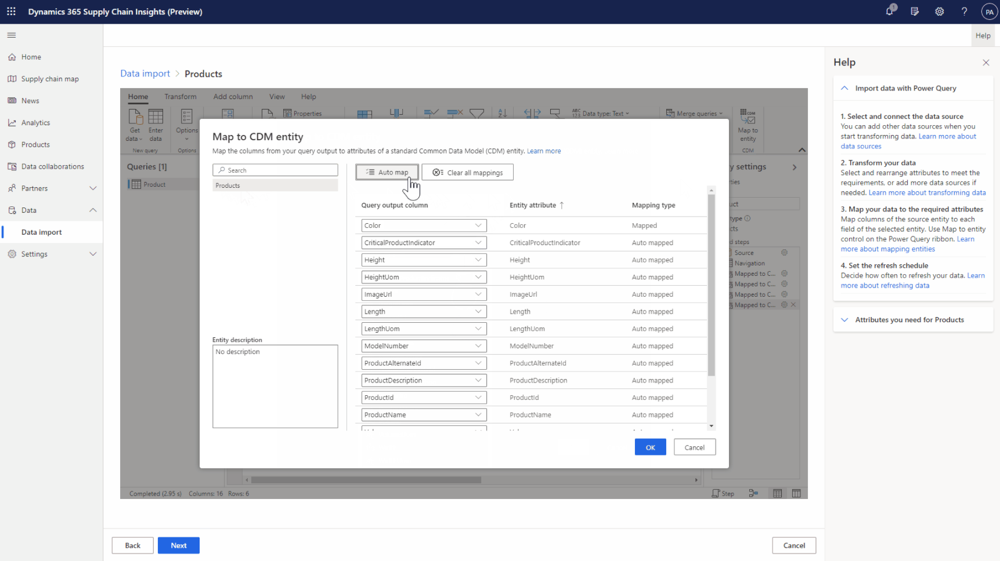

# Ingest data

[!include[banner](includes/banner.md)]
[!include[banner](includes/preview-banner.md)]

This topic describes how to ingest data into Microsoft Dynamics 365 Supply Chain Insights.

To generate insights that are relevant to your business, Dynamics 365 Supply Chain Insights requires data that is relevant to your supply chain. Therefore, that data must be brought (*ingested*) into the application. Supply Chain Insights uses [Power Query](/power-query/power-query-what-is-power-query) to help ensure a smooth data ingestion experience.

## Prerequisites

Data management requires that you ingest data from various sources, according to the entities that are described in [Data entities](entities.md). For example, this set of [Excel files](https://download.microsoft.com/download/d/c/2/dc238977-69a5-4440-a19e-24d632c25cf5/OEM_Electronics_Sample.zip) contains data for a large manufacturing company that has a supply/demand mismatch issue. Although this data set might not contain all the attributes for every entity, it's enough so that Supply Chain Insights can visually show the mismatch issue in the **Analytics** section of the application.

Before ingesting your data, review the information in [Compliance](resiliency-compliance-security.md) to ensure that Supply Chain Insights meets your company's expectations.

## Get started

To start the ingestion process, open the **Data import** page, and select an entity that has a status other than **Not imported**. Select **Not imported** or the vertical ellipsis button, and then select **Import data**.

## Sources

To enter the data for any entity, import a local comma-separated values (.csv) file or Excel (.xlsx) file from your computer, or connect Supply Chain Insights to your own data storage or cloud storage service. In both cases, make sure that your data contains the required attributes of a given entity. For example, if you upload a local file, column headers must be named. For cloud storage, additional information will be required to authenticate Supply Chain Insight's access to the data, depending on the cloud storage service that you select.

### Local file prerequisites

- An [on-premises data gateway](/data-integration/gateway/service-gateway-onprem) is required to import local files on your computer into Supply Chain Insights. For information about how to install an on-premises data gateway, see [Install an on-premises data gateway](/data-integration/gateway/service-gateway-install).
- After you install the on-premises data gateway, you must use your Supply Chain Insights user credentials to sign in to the application.
- The local folder that contains the file that you want to upload must be configured so that access is granted to everyone.

## Mappings

Mappings inform Supply Chain Insights how to interpret your data so that it can be analyzed. A mapping describes how your data is related to the attributes that represent a specific entity. It's easy to complete a mapping during the ingestion process.

### Map data from local files

Local files that you upload must have column headers, because Supply Chain Insights uses the headers to map your data to the attributes of the entity. If you select **Auto map**, Supply Chain Insights tries to use the column headers to determine which column represents which attribute. To ensure that automatic mapping is run correctly, select the **Mapped attributes** column together with the **Data preview** table at the bottom of the page. If an error occurs, or if you prefer to do the mapping manually, select the option for the required attribute in the **Mapped attributes** column, and then select the appropriate column header name.

### Map data from a cloud storage provider

The Power Query interface contains numerous tools that you can use to transform your data into a single table that contains all attributes of an entity. For more information about those tools and how to use them, see [Transform data](/power-query/power-query-ui). 

> [!NOTE]
> When you work in the Power Query editor, make sure that you don't change the name of the query. The name should always be the singular form of the entity. For example, the warehouses entity should have a query name of "warehouse." The name of the query can be found in the collapsible **Queries** pane on the left, and it can be seen as an editable field in the collapsible **Query settings** pane on the right. 
    

After you've created the table that contains the data that you want to import, you can have Power Query automatically map the information in your table to the attributes of the entity. Select **Map to entity** in the upper right, select the entity in the left column of the dialog box that appears, and then select **Auto map**. Review the query output column for any errors, or use that column to manually map your data, and then select **Done**.

## Refresh schedule for data ingested through the cloud

Up-to-date insights rely on up-to-date data ingestion. There are three ways to ensure that data ingestion is up to date:

- A refresh schedule automatically updates the ingested data for a given entity, based on any changes that were made to that data in your cloud storage solution.
- On the **Data import** page, you can update entities that are connected to your storage solution by selecting **Refresh now** on the drop-down menu.
- On the **Data import** page, you can change a refresh schedule, stop a refresh schedule, or completely disconnect the entity from a data source.
