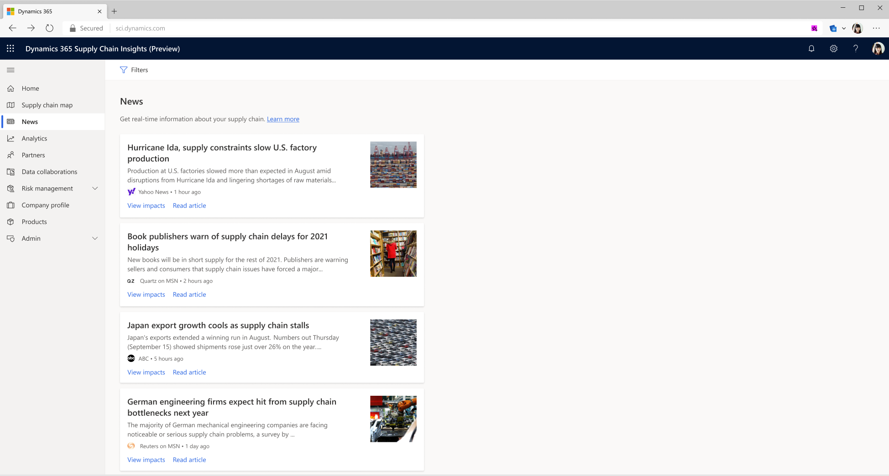

# Curated news

[!include[banner](includes/banner.md)]
[!include[banner](includes/preview-banner.md)]

This topic describes the curated news feature that is included in Microsoft Dynamics 365 Supply Chain Insights.

Dynamics 365 Supply Chain Insights is designed to help users identify and respond to external risks. The curated news feature is one way that it achieves this goal. The feature enables Supply Chain Insights to gather information about world events, and then present only the news that is relevant to your company and partner companies. To curate news articles in this way, Supply Chain Insights uses the names that were provided for your company and your vendor companies during initial onboarding.

## Prerequisites

Supply Chain Insights uses artificial intelligence to sort news articles based on their relevance to a company and its supply chain. Initially, news will be presented based on company, vendor, and customer names that were entered during the onboarding process. However, when additional vendors or customers are imported into Supply Chain Insights, or when a connection is made with another Supply Chain Insights participant, news will be curated for those companies.

## Functionality

Supply Chain Insights curates recent relevant news articles by using a trained AI model that identifies news that could affect a supply chain. The news articles are then presented as tiles on the **Home** and **News** pages of the application. If you select **Read article** on a tile, the news story is opened on a new tab. If you select **View impacts** on a tile, a page that is specific to the news article is opened. There, you can see which partners in your supply chain could be affected by the news.

> [!NOTE]
> Larger companies are more likely to be prominent in the news than smaller companies, which may affect what news articles are recommended in the curated news feature. As a result, certain sources of risks from smaller partner companies may not be highlighted.
