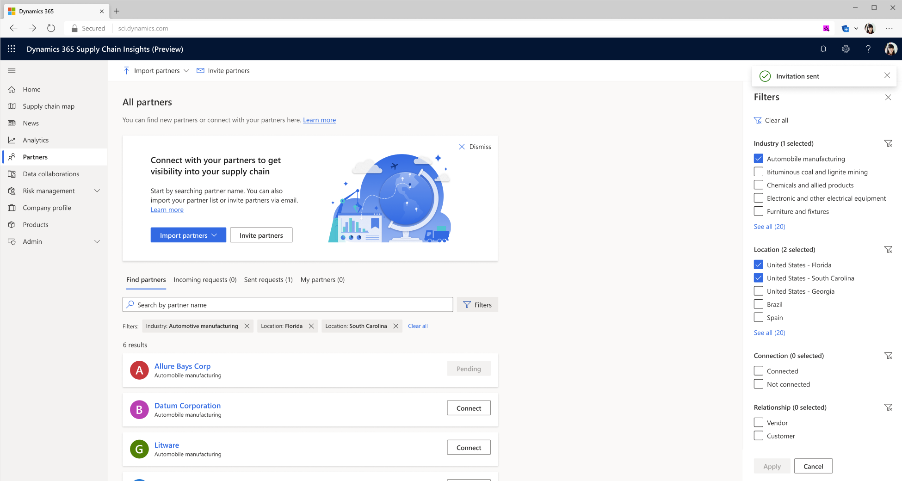
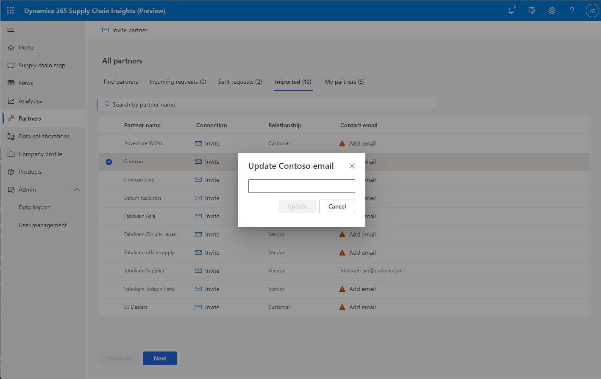

# Partner management

[!include[banner](includes/banner.md)]
[!include[banner](includes/preview-banner.md)]

Microsoft Dynamics 365 Supply Chain Insights lets you connect with your vendors and customers so that you can collaborate, share data, and gain greater visibility into your supply chain. You can invite your existing vendors and suppliers to connect with you in Supply Chain Insights, or you can find new partners to connect with.

Before you add partners, you should complete your [company profile](company-profile.md). Supply Chain Insights will suggest partners, based on the data in your company profile and the industry that your company is part of. When you connect with a partner, your contact email address and any other data that is provided in the **General information** section of your company profile is shared with the partner.

## Find and connect with partners

To view a list of companies that have joined Supply Chain Insights, go to **Partners \> All partners \> Find partners**, as illustrated in the screenshot below. 

Select a partner name or card to view the partner's company profile. To request to connect with a partner, select **Connect** on the partner card. You can add a customized note to personalize your request.

You can use the search field and filters to find specific partners. If the partner that you're looking for isn't found, you can invite them to join Supply Chain Insights by selecting **Invite partners** in the upper left of the page. You might need the company name, vendor ID, Data Universal Numbering System (DUNS) number, and contact email address to manually add the partner.

The **Imported** tab shows a list of companies that haven't joined Supply Chain Insights, but that have been detected based on the data that was ingested for your customer and vendor entities. To invite a partner that was previously imported into Supply Chain Insights, select **Invite** next to the partner's name. Supply Chain Insights requires that an email address be associated with partners that you want to invite. To add a partner email address, so that you can send the partner an invitation, select **Add email** on the **Imported** tab . Email invitations are sent to partners from an email address in the Microsoft domain. You should let invited partners know that they can expect an email from Microsoft, because it might be routed to their spam folder. After a partner joins Supply Chain Insights, they will receive a connection request from your participant. After a partner accepts a request, they can collaborate and share data.

You can import additional partners by selecting **Import partners** in the upper left of the page when no partners are selected.

### Incoming requests

The **Incoming requests** tab shows connection requests that you've received from partners. You can accept or decline the requests on this tab. After you accept a request to connect with a partner, the partner will be listed on the **My partners** tab.

### Sent requests

The **Sent requests** tab shows the status of connection requests that you've sent to partners but that haven't been accepted. The requests will be listed as either **Pending** or **Declined**. After a request is accepted, the partner will be listed on the **My partners** tab.

## Manage connections

The **My partners** tab shows a list of partners that you've connected with in Supply Chain Insights. You can manage your relationship, [start a new data collaboration with the partner](/dynamics365/supply-chain-insights/create-collaboration), [view the collaborations that have been established with the partner](/dynamics365/supply-chain-insights/review-edit-delete-collaboration), and view the general information that is included in the partner's [company profile](company-profile.md).
