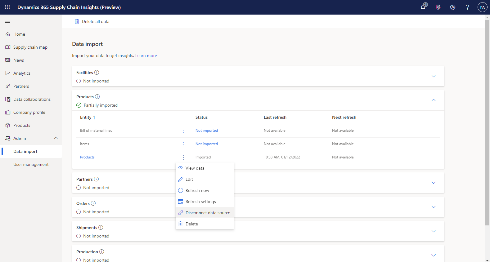

# Review, export, and delete data

[!include[banner](includes/banner.md)]
[!include[banner](includes/preview-banner.md)]

This topic describes how to review, edit, delete, and export data in Microsoft Dynamics 365 Supply Chain Insights.

The ability to review, export, and delete data in Dynamics 365 Supply Chain Insights can help you derive maximum benefits through analytics and data modeling. You can verify that the data that you've ingested is valid, and you can map to the correct entities and attributes in the application.

## Prerequisites

Data management requires that you've already ingested your data into Supply Chain Insights, either manually from your local computer or from your data storage provider.

## Review the ingested data

To review the ingested data for a given entity, select the entity name on the main **Data import** page. Alternatively, select the vertical ellipsis button for the entity, and then select **View data**. The new page that appears contains a grid that lists all the data that Supply Chain Insights has for the attributes of that entity. The panes on the right side contain tools that let you customize data to see and understand what has been ingested. Customizations that you perform by using those tools aren't saved. Therefore, your data isn't edited. For more information about the capabilities of the tools, see [Tour the report editor in Power BI](/power-bi/create-reports/service-the-report-editor-take-a-tour).

## Export data

Data export lets you download ingested data in Excel format for further analysis or partner collaboration outside Supply Chain Insights. The format of the data matches what is shown when the data is reviewed in Supply Chain Insights. To export data for an entity from Supply Chain Insights, review the ingested data, select the ellipsis button in the upper right of the grid, and then select **Export data**. In the dialog box that appears, you can select to download the data as an Excel (.xlsx) file or a comma-separate values (.csv) file.

## Delete data

Data deletion lets you delete an entity or all entities that have been ingested into Supply Chain Insights. If you see an issue or error in the ingested data, such as an incorrect data mapping or incorrect data, you can delete the incorrect data and then reingest the data. Currently, all entries for an entity are deleted. To delete the data for an entity, select the vertical ellipsis button for the entity you want to delete on the **Data import** page, and then select **Delete** from the contextual menu. To delete data for all entities, you can select **Delete all data** in the upper left of the **Data import** page.

> [!NOTE]
> When you stop ingesting data, stop sharing data with partners, or delete data from an original data source and then refresh the data within Supply Chain Insights, it may take as long as 48 hours for Supply Chain Insights to cease making the data available to partners you previously shared the data with.

## Disconnect from cloud storage providers

On the **Data import** page, you can change a refresh schedule, stop a refresh schedule, or completely disconnect the entity from a data source. To make any of these changes, select the vertical ellipses button of the entity you want to update. If you disconnect the data source, the data will no longer be refreshed. While the data will no longer be updated, the data that was previously ingested will not be deleted.

## Additional resources
[Review, edit, and delete data collaborations](review-edit-delete-collaboration.md)
