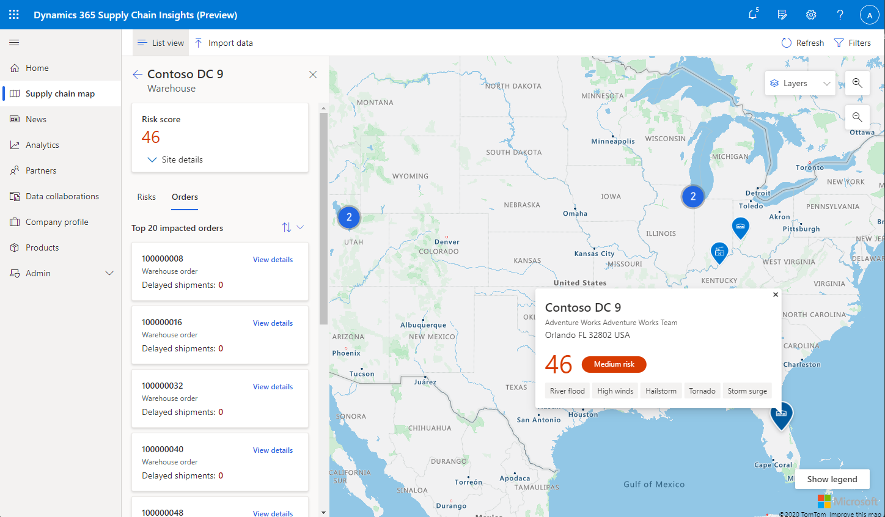
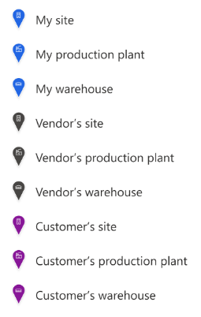

# Supply chain map

[!include[banner](includes/banner.md)]
[!include[banner](includes/preview-banner.md)]

This topic describes the supply chain map in Microsoft Dynamics 365 Supply Chain Insights.

The supply chain map in Dynamics 365 Supply Chain Insights provides a visual representation of a company's supply chain. It shows how suppliers are connected to company facilities and how those facilities are connected to customers.

Additionally, the map view provides risk data for each uploaded site. Two types of risk data are currently shown in the map view: latent weather risks, based on historical events, and real-time weather risks, such as ongoing natural catastrophes.

## Supply chain map prerequisites

The supply chain map requires that WebGL is enabled in your browser's settings. Site location information also must be ingested to add locations to the map. Initially, Supply Chain Insights adds participant and vendor locations by using the data that is provided when a participant is onboarded. Then, when other production plant and warehouse data is uploaded, or when you receive data from connected suppliers or customers in Supply Chain Insights, the map view is updated so that it includes additional locations. The map view update feature uses uploaded bills of materials (BOMs) to connect sites and to visualize the geographic flow of products and relationships between sites.

## Reading the map

The screenshot below is an example supply chain map. The following sections describe how to interpret items on the map.

### Sites

"My site," "My production plant," "My warehouse," "Vendor's site," "Vendor's production plant," and "Vendor's warehouse" are all sites that are represented by icons on the supply chain map, as shown in the following illustration.

To view your sites on the map, you must first ingest the production plant and warehouse entities into Supply Chain Insights. To view vendor sites on the map, you must first ingest vendor entities into Supply Chain Insights, and then connect and share data with those vendors.

If you hover over a site on the map, information that is related to the site appears. This information includes the company name, site address, and site risk score. If you select a site icon, a sidebar appears and shows additional site information, such as risk details and potentially affected orders. The potentially affected order functionality requires that the order entity be ingested into Supply Chain Insights, in addition to the production plant and warehouse entities that were mentioned earlier.

### Connections

Arrows and dashed lines between two sites show the flow of goods. Goods are shipped from the site at the tail end of the arrow and delivered to the site at the tip of the arrow. These connections are created based on attributes that are defined in your and your vendors' production plant, warehouse, and BOM entities. These entities must be ingested into Supply Chain Insights before the relevant connections can be shown on the supply chain map.

### Risk score

A circle that contains a number appears next to each site icon on the supply chain map and represents the correlating risk score for that site. Risk scores are ranked on a scale from 0 through 99. They are calculated by averaging all the latent weather risks for a given site and also factoring in any current weather risks as appropriate. Risk scores are classified as low, medium, or high in the following way:

- **Low** – The risk score is from 0 through 33. These risk scores are shown in green.
- **Medium** – The risk score is from 34 through 66. These risk scores are shown in orange.
- **High** – The risk score is from 67 through 99. These risk scores are shown red.

## Map views

The drop-down menu in the upper right of the supply chain map can be used to overlay various types of latent risk on the map. Initially, the view is set to a **Default** state where no latent risks are overlaid.

The following latent weather risks can be viewed on the map:

- River flooding
- High winds
- Hailstorms
- Seismic events
- Tornadoes
- Lightning
- Ash thickness
- Subsidence
- Storm surges

### Filters

Filters are provided to help you focus on different aspects of your supply chain. If you select **Filters** in the upper right of the command bar, a sidebar appears and shows filtering options. You can currently filter by facility type and vendor visibility. By default, the vendor visibility filter is set to show all uploaded vendors, regardless of tier.

### List

If you select **List** in the upper left of the command bar, a sidebar appears on the left side of the map and shows a list of sites. Initially, the sites are ranked from highest risk to lowest risk. However, you can reorder them by risk score or site name. If you select a specific site on the supply chain map, information that is related to that site appears, such as risk details and order information.
